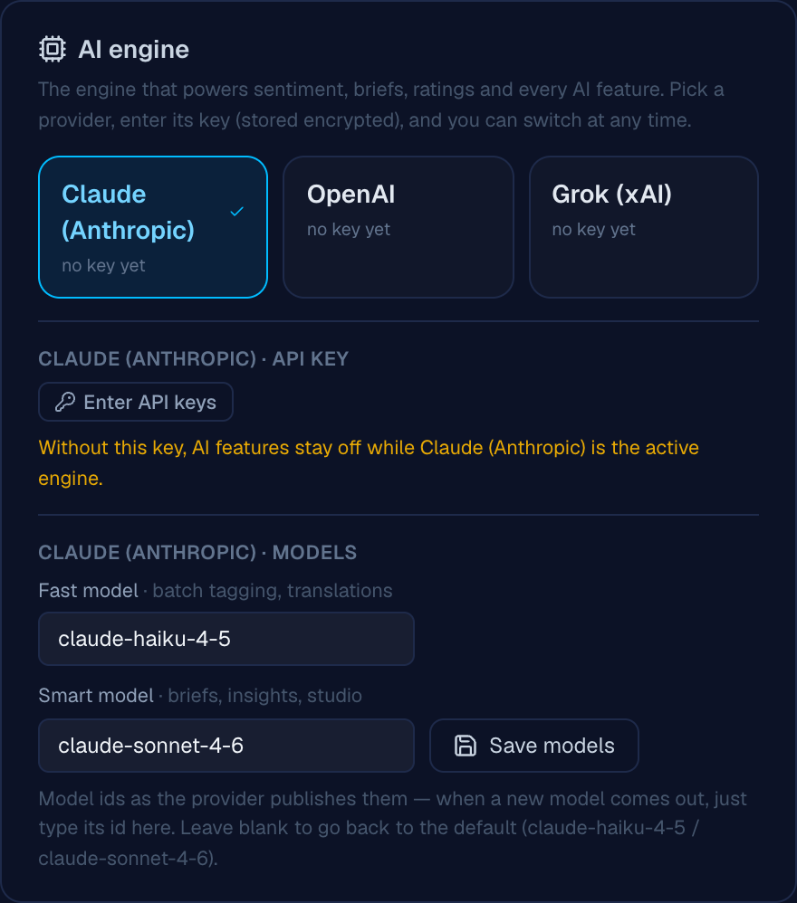
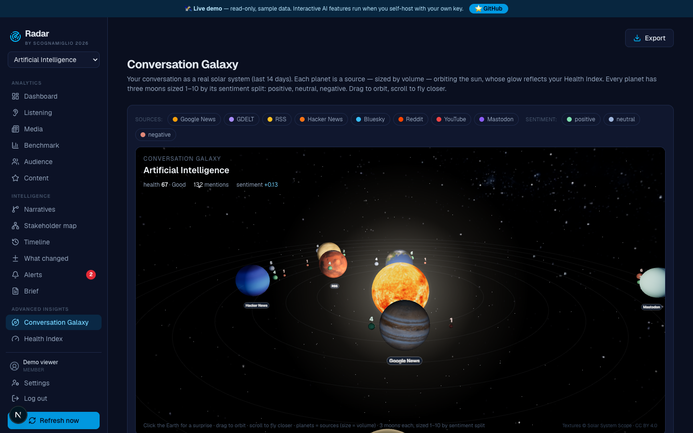
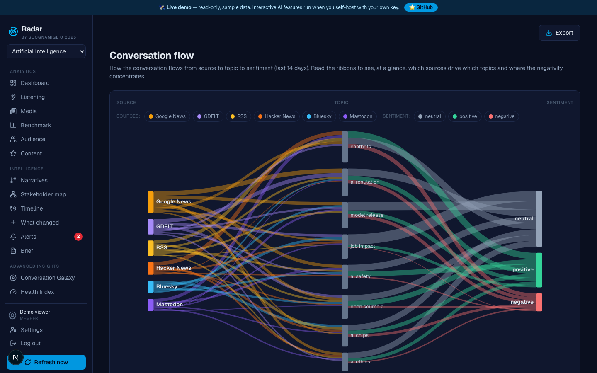
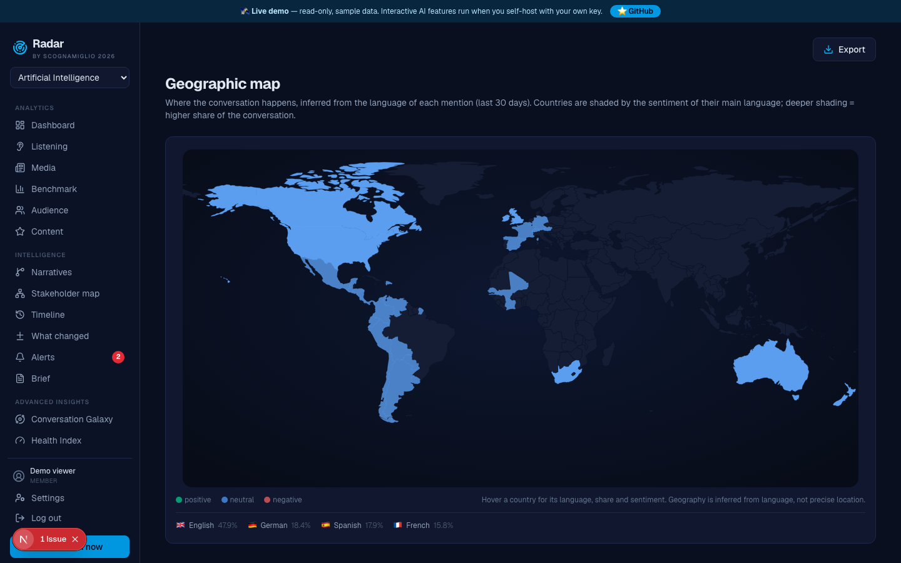
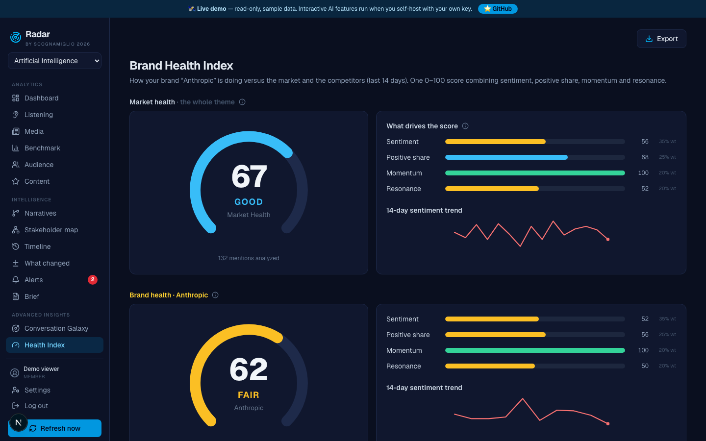

# Radar

**Open-source media intelligence & social listening** — an alternative to enterprise
platforms like Talkwalker or Brandwatch, built on free data sources and the **AI provider
of your choice** (Claude, OpenAI or Grok). Self-hostable, bring-your-own-keys, runs locally
with zero configuration.


> The user interface and AI outputs are in English. Full internationalization (i18n) for
> additional languages is on the roadmap and contributions are very welcome.

⭐ **If Radar is useful, consider giving it a star.**

## Screenshots


Pick your AI engine — Claude, OpenAI or Grok — enter its key and set the models, all from
the app. No code, no redeploy:




The whole conversation as a real 3D solar system — sources are planets, sentiment split
becomes moons, the sun is your Health Index:



Source → Topic → Sentiment flow, with multi-select cross-filtering:



Real-world geographic map and the executive Health Index:





---

## Why Radar

Enterprise listening tools cost thousands per month. Radar gives a single person or a
small team the same core workflow — **listen, analyze, decide, create** — using public
data sources and the Claude API, for the price of an API key (or nothing at all if you
just want to collect data).

- **Your AI, your choice**: run every AI feature on **Claude (Anthropic), OpenAI or Grok
  (xAI)**. Pick the engine, paste its key, and even set which models power the fast (bulk
  tagging) and smart (briefs, insights) tiers — all from *Settings → Budget*, no code and
  no redeploy. Switch providers anytime; the spend cap works the same for all of them.
- **9 free sources** out of the box: worldwide news via GDELT (100k+ outlets, 65+
  languages) and Google News, plus Bluesky, Mastodon, Hacker News, Telegram, RSS —
  and Reddit / YouTube with a free API key.
- **6 premium connectors ready** (X, Instagram, Facebook, TikTok, LinkedIn, NewsAPI) —
  drop in a key and the source turns on.
- **AI analysis with Claude**: sentiment, **emotion** (joy/trust/fear/anger/sadness/
  surprise), relevance scoring, story clustering, daily executive briefs, conversation
  clusters, cause-effect chains, quality scores.
- **Brand vs Market Health Index**: one 0–100 score for the whole theme, and — when you
  flag one benchmark entity as *your brand* — your brand's score next to the market and a
  competitive ranking.
- **12 advanced insight visualizations** (see below), from a live 3D "Conversation Galaxy"
  to a Share-of-Voice streamgraph, a Source→Topic→Sentiment Sankey and a real-world map.
- **Content Studio**: turn a concept into a multi-format kit, explore alternative hooks,
  refine drafts conversationally in your brand voice.
- **Cost control**: an admin-set spend cap on the AI, a password-protected reset, and an
  all-time total across every user — the app stops calling the AI at the cap while data
  collection keeps running.
- **Exports**: branded PDF, PowerPoint, Word, Excel — every insight included. Read-only
  share links.

## Try it in 30 seconds (local, zero config)

No database, no keys, no cloud account required. Uses an embedded database (PGlite) and
runs entirely offline. AI features stay idle until you add a key for your chosen engine
(Claude, OpenAI or Grok).

```bash
git clone https://github.com/Scognamiglio1969/radar-intelligence.git
cd radar-intelligence
npm install
npm run dev
# open http://localhost:3000  ·  first login: admin@example.com / changeme
```

To enable AI, add your own key to `.env.local` (or paste it later from *Settings → Budget*):

```bash
cp .env.example .env.local
# Claude:  ANTHROPIC_API_KEY=...   (https://console.anthropic.com)
# OpenAI:  OPENAI_API_KEY=...      (https://platform.openai.com)
# Grok:    XAI_API_KEY=...         (https://console.x.ai)
```

## Deploy your own

One-click deploy to Vercel (add a free [Neon](https://neon.tech) Postgres and your keys
when prompted):

[](https://vercel.com/new/clone?repository-url=https://github.com/Scognamiglio1969/radar-intelligence)

Minimum production env vars: `DATABASE_URL`, `SESSION_SECRET`. Recommended:
`ANTHROPIC_API_KEY`, `ADMIN_EMAIL`, `ADMIN_PASSWORD`. See [`.env.example`](.env.example)
for the full, commented list.

## Bring your own keys (BYOK)

Radar never ships with anyone's keys — you bring your own, and everything is stored
**encrypted at rest**.

- **AI engine key** — powers all AI features (sentiment, briefs, ratings, clustering,
  Content Studio, "Ask the data"…). In *Settings → Budget → AI engine* choose your provider —
  **Claude, OpenAI or Grok** — and paste its key, or set the matching environment variable
  (`ANTHROPIC_API_KEY`, `OPENAI_API_KEY` or `XAI_API_KEY`). The default models per provider
  are editable, so a newly released model just needs its id typed in — no code change. No key
  needed just to collect data.
- **Data-source keys** (X, Instagram, Facebook, TikTok, LinkedIn, NewsAPI, Reddit, YouTube) —
  configured **from the UI** in *Settings → Sources*, or via environment variables as a fallback.

Nothing requires editing code or redeploying: an admin adds the keys from the app and the
features turn on immediately.

## Modules

| Page | What it does |
|---|---|
| Dashboard | KPIs, volume per source, sentiment, emerging topics, latest brief |
| Listening | Stream of every mention with filters (source, sentiment, language, period, text) |
| Media | News grouped into stories (AI clustering) + most active outlets |
| Benchmark | Share of voice, trends and comparative sentiment across configurable entities |
| Audience | Most active communities, languages, influential authors, topics by community |
| Content | Engagement ranking (per-platform percentile) + AI quality score |
| Advanced insights | 12 dedicated visualizations — see the section below |
| Content Studio | Concept → multi-format kit, Hook Lab, conversational refinement |
| Alerts / Brief | Auto-detected volume spikes & sentiment drops; daily executive brief |
| War Room | Full-screen live view for a wall display |
| Settings | Tabbed: **My account**, **Team** (mark one entity as *your brand*), **Sources** (connector status & keys), **Budget** (choose the AI engine — Claude/OpenAI/Grok — its key & models, spend cap, admin cost controls), **Credits & Legal** |

## Advanced insights

A suite of purpose-built visualizations, each on its own page and each included in the
PDF / PowerPoint / Word / Excel exports:

| Insight | What it shows |
|---|---|
| **Conversation Galaxy** ✦ | The whole conversation as a real WebGL solar system: the sun is your Health Index, planets are sources (size = volume) with photographic NASA-based textures, and each planet has three moons sized 1–10 by its sentiment split. Drag to orbit, scroll to fly closer. |
| **Health Index** | One 0–100 composite (sentiment, positive share, momentum, resonance). Market health always; **Brand health + competitive ranking** when you flag *your brand*. |
| **Share of Voice** | 100% stacked area of each entity's share of the conversation over time, plus an explicit 30-day ranking. |
| **Conversation flow** | Source → Topic → Sentiment Sankey. **Multi-select cross-filtering**: pick any sources × sentiments to isolate a sub-flow (e.g. what drives negativity in two sources). Rich hover tooltips. |
| **Momentum quadrant** | Topics by volume × acceleration: Rising stars / Emerging / Steady / Declining. |
| **Emotion radar** | The emotional fingerprint beyond sentiment (joy, trust, fear, anger, sadness, surprise). |
| **Geographic map** | Real-world choropleth: each language shades its countries (English → US/UK/CA/AU, Spanish → Latin America…), colored by sentiment. |
| **Semantic constellation** | Key terms as a star map — size = frequency, color = sentiment, links = co-occurrence. |
| **Influencer network** | Force-directed graph of the top authors, clustered by community, sized by engagement. |
| **Author pyramid** | Authors tiered by influence (mega / macro / micro / long tail) with the share of reach each tier holds — is your conversation carried by a few big voices or broadly distributed? |
| **Crisis radar** | A risk gauge plus the anatomy of the biggest spike: what drove it, and the content that weighed most. |
| **Topics · Heatmap · Waterfall · Clusters · Cause-effect** | Topic×sentiment map, hourly heatmap, sentiment waterfall, conversation clusters, AI cause-effect chains. |

## Architecture

- **Next.js 16** (App Router) — deploys on Vercel, dark theme
- **Postgres**: Neon in production, embedded **PGlite** for local dev (zero setup)
- **Drizzle ORM**, schema created & migrated automatically on boot
- **Pluggable AI engine** — Claude (`@anthropic-ai/sdk`), OpenAI or Grok (OpenAI-compatible
  API), switchable from the UI, all behind one hard monthly spend cap
- **Recharts** + hand-built SVG/Canvas charts, and **three.js** for the 3D galaxy
- Pluggable **connectors** (`lib/connectors/`) — adding a source is one small file

See [CONTRIBUTING.md](CONTRIBUTING.md) for a walk-through of adding a connector.

Planet/sun/moon textures in the Conversation Galaxy are © [Solar System Scope](https://www.solarsystemscope.com/textures/),
licensed **CC BY 4.0**.

## Legal & responsible use

Radar collects publicly available data. **You are responsible** for complying with the
Terms of Service of each data source (Reddit, X, Meta, GDELT, Google News, etc.) and with
applicable data-protection laws (e.g. GDPR) in your jurisdiction. Some sources restrict
automated access; enable only what you are entitled to use. This project is provided as-is,
without warranty. See [SECURITY.md](SECURITY.md) to report vulnerabilities.

## Contributing

Issues and pull requests are welcome — see [CONTRIBUTING.md](CONTRIBUTING.md) and our
[Code of Conduct](CODE_OF_CONDUCT.md). Good places to start: internationalization,
new connectors, tests.

## License

[GNU AGPL-3.0](LICENSE) © Massimo Scognamiglio and contributors. If you run a modified
version as a network service, you must make your source available under the same license.
