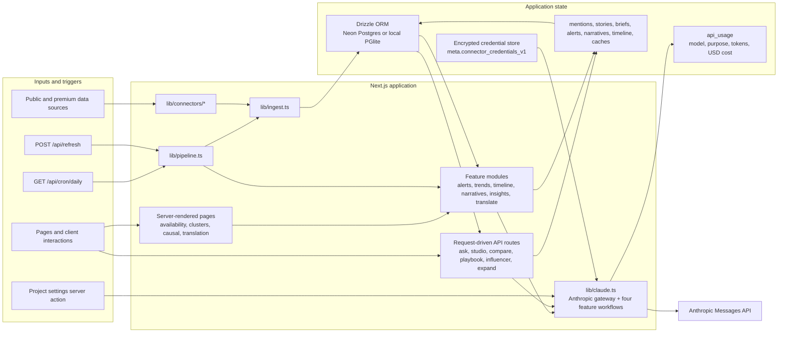
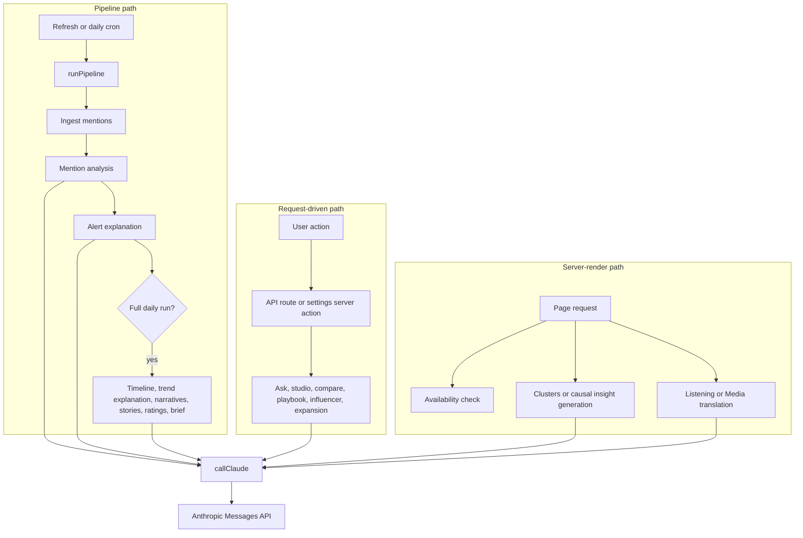
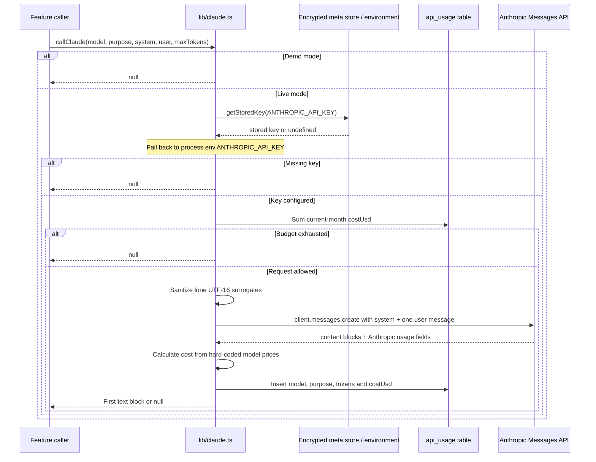

# Current LLM architecture and Anthropic coupling

This document maps Radar's current architecture around LLM access. It records the
existing system and its Anthropic dependencies so a separate follow-on plan can
introduce a provider interface without overlooking runtime paths or operational
behaviour.

## Scope and summary

All LLM requests ultimately pass through [`callClaude`](../lib/claude.ts), a
text-in/text-out wrapper around `@anthropic-ai/sdk`. This is a useful de facto
gateway, but it is not a provider boundary: its name, client, request and response
shapes, model identifiers, prices, credentials, availability checks and logging are
all Anthropic-specific.

The dependency has four layers:

1. **SDK protocol coupling** in `lib/claude.ts`.
2. **Feature coupling** through direct imports of `callClaude`, `claudeAvailable`
   and `MODELS` across pipeline jobs, API routes, server actions and render paths.
3. **Operational coupling** in credentials, settings, budget reporting and stored
   usage.
4. **Product-language coupling** in UI copy, documentation and deployment guidance.

There are currently **21 `callClaude` invocations** and **27 files that import
`lib/claude.ts` directly**. No OpenAI client, Vercel AI SDK dependency, provider
interface or provider selection mechanism exists today.

## System architecture



The database transport is selected independently: `DATABASE_URL` uses Neon and an
unset value uses local PGlite. Both are exposed through the same Drizzle-based
[`getDb`](../lib/db/index.ts) function.

## LLM execution paths



### Scheduled pipeline

- [`POST /api/refresh`](../app/api/refresh/route.ts) runs the short pipeline:
  ingestion, mention analysis, alert detection and trend computation.
- [`GET /api/cron/daily`](../app/api/cron/daily/route.ts) runs the full pipeline and
  adds timeline extraction, trend explanations, narratives, story clustering,
  content ratings and the daily brief.
- [`runPipeline`](../lib/pipeline.ts) skips LLM analysis for projects whose owner is
  not AI-enabled. Data ingestion still runs.
- `DEMO_MODE=1` is a second, global brake inside `callClaude`: configured keys do
  not result in LLM spend.

### Request-driven features

Nine API routes call the gateway directly. Project keyword expansion also calls it
from the [`saveAndExpandProject`](../app/settings/actions.ts) server action. These
paths first check `claudeAvailable`, then usually turn a `null` response into a
provider/budget error response.

### Render-time features

- [`getClusters`](../lib/insights.ts) and
  [`getCausalChains`](../lib/insights.ts) generate on a cache miss. Their pages call
  these functions during server rendering; explicit POST endpoints can force a
  refresh.
- [`translateMentions`](../lib/translate.ts) is called while the Listening and Media
  pages render when the translation cookie is set. Results are cached on mentions.
- Several pages call `claudeAvailable` during rendering to enable controls or choose
  empty-state copy.

## The current gateway



The public gateway contract is:

```ts
callClaude(
  model: string,
  purpose: string,
  system: string,
  user: string,
  maxTokens: number,
): Promise<string | null>
```

Useful provider-neutral concepts already present are `purpose`, separate system and
user text, a maximum output-token request, text output, and token/cost telemetry.
They are not represented by shared types or an interface.

## LLM call inventory

Model tiers below refer to the current aliases: `haiku` is
`claude-haiku-4-5`; `sonnet` is `claude-sonnet-4-6`.

| Runtime path | Feature / purpose | Model | Max output tokens | Result use |
|---|---|---:|---:|---|
| `lib/claude.ts` | Mention analysis / `mention_analysis` | Haiku | 3,800 | Updates language, sentiment, relevance, emotion, topics and entities |
| `lib/claude.ts` | Content ratings / `content_ratings` | Sonnet | 3,500 | Stores structured quality ratings on mentions |
| `lib/claude.ts` | Story clustering / `story_clustering` | Sonnet | 3,000 | Creates stories and links mentions |
| `lib/claude.ts` | Daily brief / `daily_brief` | Sonnet | 1,300 | Upserts Markdown into `briefs` |
| `lib/alerts.ts` | Alert explanation / `alert_explanation` | Haiku | 200 | Adds prose context to an alert |
| `lib/trends.ts` | Trend explanation / `trend_radar` | Haiku | 150 | Stores a one-sentence trend explanation |
| `lib/timeline.ts` | Timeline extraction / `timeline_eventi` | Haiku | 700 | Inserts structured timeline events |
| `lib/narratives.ts` | Narrative detection / `narrazioni` | Sonnet | 2,500 | Inserts structured narrative clusters |
| `lib/insights.ts` | Conversation clusters / `cluster_conversazionali` | Sonnet | 1,500 | Stores a daily JSON cache in `meta` |
| `lib/insights.ts` | Cause and effect / `causa_effetto` | Sonnet | 1,600 | Stores a daily JSON cache in `meta` |
| `lib/translate.ts` | Translation / `traduzione` | Haiku | 4,000 | Caches translated title/content on mentions |
| `app/settings/actions.ts` | Project term expansion / `espansione_progetto` | Haiku | 400 | Merges generated terms into project keywords |
| `app/api/expand/route.ts` | Search expansion / `semantic_search` | Haiku | 400 | Returns expanded search terms |
| `app/api/ask/route.ts` | Ask the data / `ask_the_data` | Sonnet | 1,000 | Returns an analyst answer |
| `app/api/compare/route.ts` | Weekly comparison / `weekly_comparison` | Sonnet | 900 | Returns a comparison narrative |
| `app/api/influencer/route.ts` | Influencer profile / `influencer_profile` | Sonnet | 900 | Returns a generated profile |
| `app/api/playbook/route.ts` | Crisis playbook / `crisis_playbook` | Sonnet | 1,300 | Stores and returns a playbook on an alert |
| `app/api/studio/route.ts` | Content ideas / `content_studio` | Sonnet | 1,500 | Stores and returns Markdown ideas |
| `app/api/studio/kit/route.ts` | Content kit / `studio_kit` | Sonnet | 1,800 | Returns a multi-format content kit |
| `app/api/studio/hooks/route.ts` | Hook generation / `studio_hooks` | Haiku | 700 | Returns a JSON list of hooks |
| `app/api/studio/refine/route.ts` | Draft refinement / `studio_refine` | Haiku | 900 | Returns revised text |

## Anthropic connection inventory

### 1. Protocol and SDK: hard coupling

| Connection | Location | Why it is provider-specific |
|---|---|---|
| SDK dependency | [`package.json`](../package.json) and lockfile | Only `@anthropic-ai/sdk` is installed |
| Client construction | [`lib/claude.ts`](../lib/claude.ts) | Instantiates `new Anthropic({ apiKey })` |
| Request shape | [`lib/claude.ts`](../lib/claude.ts) | Calls `client.messages.create` with Anthropic's `system`, `messages` and `max_tokens` fields |
| Response extraction | [`lib/claude.ts`](../lib/claude.ts) | Searches Anthropic content blocks for the first `type === 'text'` block |
| Usage extraction | [`lib/claude.ts`](../lib/claude.ts) | Reads `usage.input_tokens` and `usage.output_tokens` |
| Model catalogue | [`lib/claude.ts`](../lib/claude.ts) | Hard-codes Claude model IDs and exports Claude-specific `MODELS` aliases |
| Price calculation | [`lib/claude.ts`](../lib/claude.ts) | Hard-codes per-model Anthropic input/output USD rates |

### 2. Feature code: direct gateway coupling

Feature modules and routes import from `@/lib/claude` rather than depending on a
provider-neutral service. They choose `MODELS.haiku` or `MODELS.sonnet` themselves,
so model routing policy is distributed across all 21 calls.

The four workflows implemented directly inside `lib/claude.ts` are additionally
coupled by **co-location**: mention analysis, content ratings, story clustering and
brief generation combine domain queries, prompts, parsing and persistence with the
Anthropic transport gateway.

### 3. Configuration and credentials

| Connection | Location | Current behaviour |
|---|---|---|
| Credential name | [`lib/claude.ts`](../lib/claude.ts), [`.env.example`](../.env.example) | Only `ANTHROPIC_API_KEY` is recognised |
| Stored connector ID | [`lib/connector-credentials.ts`](../lib/connector-credentials.ts) | Credential fields are registered under `anthropic` |
| Credential precedence | [`lib/claude.ts`](../lib/claude.ts) | Encrypted stored key wins; environment variable is fallback |
| Availability | [`lib/claude.ts`](../lib/claude.ts) | `claudeAvailable()` means exactly “an Anthropic key exists”; it does not validate the key or budget |
| Provider selection | — | No configured provider, default provider or per-feature override exists |

Credentials entered in the UI are encrypted into the `meta` table under
`connector_credentials_v1`. Encryption itself is generic, but field registration,
labels and lookup are Anthropic-specific.

### 4. Models, cost and usage

The `api_usage` table is mostly provider-neutral—it stores model, purpose, token
counts and USD cost—but has no provider column. Cost is computed before insertion
using the hard-coded Claude price map. Consequently:

- historical rows cannot be reliably grouped by provider if model names overlap;
- an unknown model silently uses the Sonnet price fallback;
- usage and cost depend on Anthropic's response fields and pricing semantics;
- the global `API_BUDGET_USD` cap is shared in name, but its implementation assumes
  all rows were priced comparably by the current gateway.

The settings page imports `monthlyBudgetUsd`, reads `api_usage`, and presents the
result as “Claude API budget”.

### 5. Availability, errors and control flow

- `claudeAvailable()` is imported by feature modules, API routes and server-rendered
  pages. A provider migration therefore affects both execution and presentation.
- `callClaude()` returns `null` for demo mode, no key, exhausted budget, or a response
  without a text block. Callers cannot distinguish these cases.
- Anthropic SDK exceptions are not normalised or caught in the gateway. Some callers
  catch errors locally, while most allow them to become route or pipeline failures.
- API routes use Anthropic-specific “Claude API key not configured” errors, then use
  a combined “spend cap reached or API error” message for `null` results.

These behaviours form part of the effective contract that a provider interface plan
must either preserve or deliberately revise.

### 6. Product copy and deployment documentation

Provider-specific language appears in:

- settings, empty states and API error messages under `app/`;
- [`.env.example`](../.env.example), [`README.md`](../README.md),
  [`CONTRIBUTING.md`](../CONTRIBUTING.md) and [`SECURITY.md`](../SECURITY.md);
- the static [`public/tour.html`](../public/tour.html);
- comments and log prefixes in `lib/`.

This is migration work, but it is not transport coupling. It can be handled after a
provider-neutral runtime is defined, with a decision on whether the UI names the
selected provider or uses generic “AI” terminology.

### 7. Anthropic references that are not LLM dependencies

The default and demo seed data mention Anthropic and Claude as monitored companies,
keywords and example entities. Those references are sample media-intelligence data,
not runtime coupling, and should not be mechanically renamed during a provider
refactor:

- [`lib/db/index.ts`](../lib/db/index.ts)
- [`lib/db/demo-seed.ts`](../lib/db/demo-seed.ts)

## Existing seams and constraints for the follow-on plan

The most natural existing seam is the single text-generation operation represented
by `callClaude`, with availability, credential lookup, usage accounting and budget
enforcement adjacent to it. The follow-on design still needs explicit decisions on:

- whether the core contract stays text-only or supports structured output/streaming;
- whether callers choose capability tiers such as “fast” and “capable,” or concrete
  provider model IDs;
- how OpenAI-compatible base URLs, keys and model names are configured;
- whether Vercel AI SDK is the common transport, or one implementation beside a
  direct OpenAI-compatible implementation;
- where provider selection lives: deployment-wide, project-wide or per feature;
- how provider-aware pricing, usage and budget enforcement are represented;
- whether `null` remains the failure/disabled signal or is replaced by typed results;
- how to separate the four domain workflows currently co-located with the transport
  in `lib/claude.ts`;
- how to test request mapping, response parsing, budget behaviour and every execution
  path without making live provider calls.

These are planning inputs, not proposed decisions. The current code does not provide
evidence for choosing between them.
