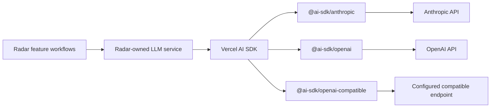

# Vercel AI SDK provider notes

## Finding

It is feasible to use the Vercel AI SDK as the common LLM interface without using
Vercel AI Gateway.

The two products serve different purposes:

- **Vercel AI SDK** is an open-source TypeScript abstraction over model providers.
  It supplies APIs such as `generateText`, `streamText`, structured outputs,
  normalized token usage and common provider model interfaces.
- **Vercel AI Gateway** is an optional hosted service for routing, authentication,
  observability and billing. It is not required when using the AI SDK.

The important distinction is how a model is passed to the SDK:

- A string such as `"openai/gpt-5"` uses the AI Gateway default provider.
- A model created by a provider package, such as `anthropic(...)` or `openai(...)`,
  calls that provider directly.

## Direct provider example

```ts
import { generateText } from 'ai';
import { anthropic } from '@ai-sdk/anthropic';

const result = await generateText({
  model: anthropic('claude-sonnet-4-6'),
  system,
  prompt: user,
  maxOutputTokens: 1_500,
});
```

This uses Anthropic directly and does not send the request through Vercel AI
Gateway.

## OpenAI-compatible endpoint example

```ts
import { createOpenAICompatible } from '@ai-sdk/openai-compatible';
import { generateText } from 'ai';

const provider = createOpenAICompatible({
  name: 'configured-provider',
  baseURL: process.env.AI_BASE_URL!,
  headers: {
    Authorization: `Bearer ${process.env.AI_API_KEY}`,
  },
});

const result = await generateText({
  model: provider(process.env.AI_MODEL!),
  system,
  prompt: user,
  maxOutputTokens,
});
```

This supports services exposing an OpenAI-compatible API without requiring the
OpenAI service or Vercel AI Gateway.

## Recommended Radar architecture



Radar should retain a small application-owned interface above the AI SDK instead
of exposing AI SDK models throughout the feature code:

```ts
type ModelTier = 'fast' | 'capable';

type GenerateRequest = {
  purpose: string;
  modelTier: ModelTier;
  system: string;
  prompt: string;
  maxOutputTokens: number;
};

type GenerateResult = {
  text: string;
  inputTokens?: number;
  outputTokens?: number;
};

interface LlmService {
  isAvailable(): Promise<boolean>;
  generate(request: GenerateRequest): Promise<GenerateResult>;
}
```

The AI SDK would then be an implementation detail of this interface.

## Responsibilities that remain in Radar

The AI SDK can normalize provider calls and token usage, but it should not become
the owner of Radar's application policy. The Radar-owned layer should continue to
handle:

- provider and credential selection;
- mapping capability tiers such as `fast` and `capable` to provider model IDs;
- demo-mode behaviour;
- monthly spend enforcement;
- provider-aware USD price calculation;
- `api_usage` persistence;
- availability and error normalization;
- application logging and provider metadata.

In particular, AI SDK token usage is useful input for the existing usage system,
but the current USD budget cap still requires Radar-owned pricing and accounting.

## Structured output opportunity

AI SDK structured output through `generateText` and `Output.object` could eventually
replace several prompts that request JSON followed by manual bracket extraction and
`JSON.parse` calls.

This should be treated as a separate improvement after introducing the provider
boundary. Combining structured-output migrations with the initial provider change
would make regression diagnosis harder.

## Conclusion

Use the Vercel AI SDK as the common provider implementation layer, without Vercel
AI Gateway, behind a thin Radar-owned LLM service. This provides direct Anthropic,
OpenAI and OpenAI-compatible implementations while keeping provider selection,
budget policy and operational behaviour under application control.

## References

- [Choosing a provider](https://ai-sdk.dev/docs/getting-started/choosing-a-provider)
- [AI SDK README: Gateway and direct provider examples](https://github.com/vercel/ai/blob/ai@6.0.0/packages/ai/README.md)
- [OpenAI-compatible provider example](https://github.com/vercel/ai/blob/main/examples/ai-functions/src/generate-text/openai/compatible-deepseek.ts)
- [`generateText` result and normalized usage](https://github.com/vercel/ai/blob/main/packages/ai/src/generate-text/generate-text-result.ts)
